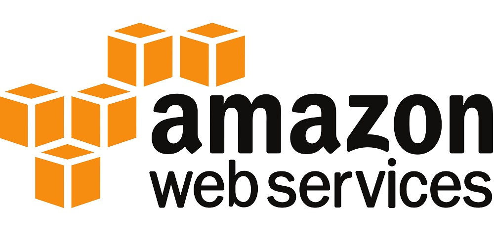
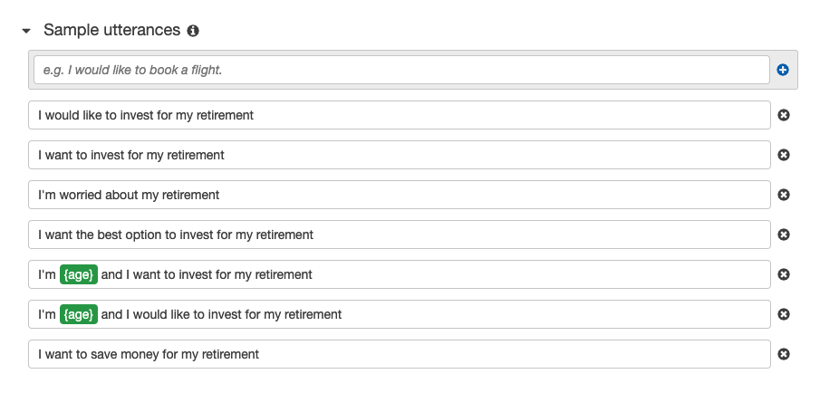
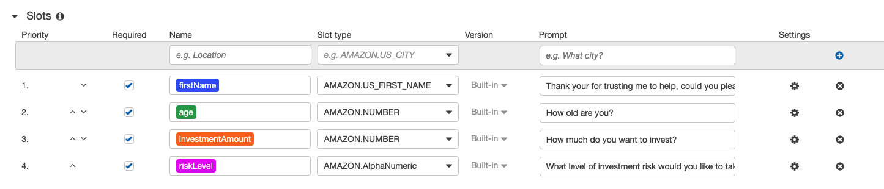
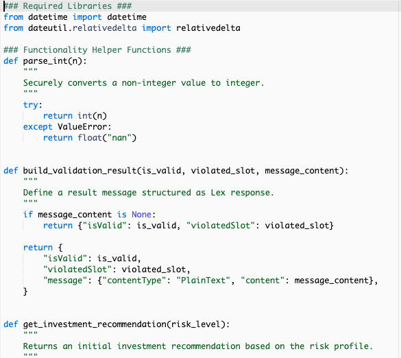
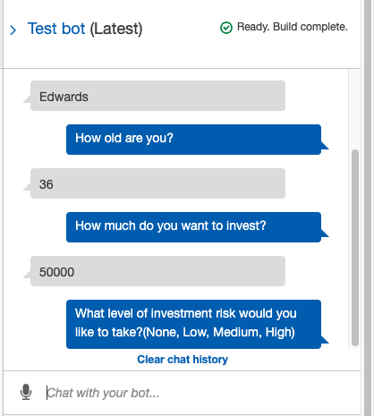

# Week-15-RoboAdvisor
---
AWS(Amazon Web Services) is a cloud based service offered by Amazon to induviudals, businesses, organizations, and governments, enabling them to use different services by connecting to the cloud. Different services offered by Amazon include SAAS,PAAS,and IAAS, which inlude services like Lex(Automated Bots), Lambda(Serverless Network), SageMaker(For deploying machine learing and its applications), S3(Cloud storage) are some of the services offered by Amazon's AWS.

---

### Program:

This program allows user to briefly interact with an automated bot and talk through a demo verison of financial advisory.It plays an role of an consultant helping the user figure out investment for retirement.

---

### Requirements and Installations:

The program was configured on AWS using LEX, and Lambda, while the codes for Lambda were written using Python 3.7. The Bot was programmed on Lex.

The codes for Lamda include the functions that were designed to properly process the user interaction. 

---

### Robo Advisor:

Lex is designed to take cues in forms of utterance what user inteends to do.

The, we try to solicit slots, which act as key information.

Based on the slots, Lambda comes to playto assist the bot in making appropriate responses and conditions.

The interaction looks like a chat between two humans, but Lex uses Machine Learning to take cues to emulate human behaviors.

---

Babin Shrestha